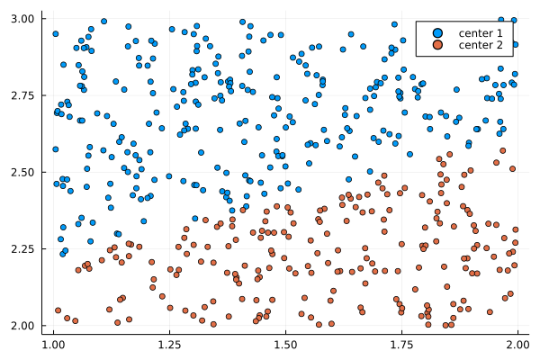
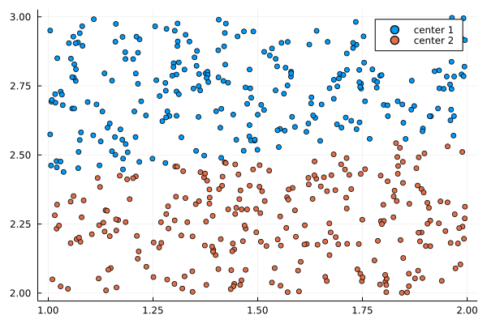

# Clustering Strategies
For the algorithms defined in this pakage the given set of points have to be sorted in an algebraic tree. 
The following terms are used to describe the algorithms:

-  Root: The root of the tree contains all points of the set.
-  Node: The root is the first node. Each node gets split up in n children.
-  Level: The root is the 0 level. On each level every node gets split up in n parts.
-  Children: The Children of a node are the parts in which the node splits up. 
-  Parent: If a node gets split up in n children it is the parent to each of them.  

## Box Tree 
## K-Means Clustering Tree
### Definition
The K-Means Algorithm aims to cluster a set points in k groups. Each group is defined by a center choosen randomly out of the set of givn points.
Each point belongs to the closest center. The algorithm iteratively sorts the points and recalculates the centers by taking the mean over the points in each group.

To generate a tree the algorithm is repeated for each group until a givn amount of levels or a minimum amount of points in a node is reached.

### Example
For explenation a random distribution of points will be sorted in a binary tree. 
On Level 0 the algorithm takes randomly two points as the first centers


In the first itaration the points get sorted by the criteria 

```math
    min(\sum_{n=1}^{N} norm(p_n - c_1), \sum_{n=1}^{N} norm(p_n - c_2))
```

Resulting in the following groups:



To achieve an more equal distribution, each group calculates a new center by taking the mean over all points. Afterwards all points are resorted to each center. This step is repeted 10 times and leads to the following distribution:



For each group the algorithm chooses two new centers from the sorted points and repeats the algorithm. 

### Comments
As it can be seen in the example more iterations will lead to more equal sized groups. For non homogenous distributions equal sized groups can´t always be reached, but more iterations will generate in general a better tree structure for the algorithms in this package.
For the the algorithms in this package iterations between 10-100 and two children for each level are recomended.
